### Examen 2
**Universidad ICESI**  
**Curso:** Sistemas Operativos  
**Docente:** Daniel Barragán C.  
**Tema:** Namespaces, CGroups, LXC
**Correo:** daniel.barragan at correo.icesi.edu.co

**Estudiante:** Daniel Steven Ocampo   
**Código:** A00053980    
**Github:** https://github.com/DanielOcampo23/so-exam2      

### Objetivos
* Comprender los fundamentos que dan origen a las tecnologías de contenedores virtuales
* Conocer y emplear funcionalidades del sistema operativo para asignar recursos a procesos
* Conocer y emplear capacidades de CentOS7 para la virtualización

### Prerrequisitos
* Virtualbox o WMWare
* Máquina virtual con sistema operativo CentOS7

### Descripción
El segundo parcial del curso sistemas operativos trata sobre el manejo de namespaces, cgroups y virtualización por medio de LXC/LXD

### Solución
3. Para realizar esta prueba de concepto, utilizamos una máquina virtual con el sistema operativo CentOS 7 y la configuramos para que solo utilice un núcleo de nuestro procesador.

 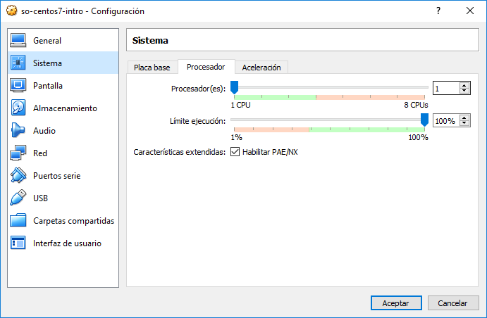

Primero creamos dos scripts para poder estresar el procesador, es decir con los que podamos ocupar el 100% de su capacidad de procesamiento, para esto ambos scripts (countA.sh y countB.sh) tienen el siguiente código:

```bash
#!/bin/bash
i=0;
while true
do
   let i=i+1;
done
```
Este algoritmo lo único que realiza es una suma dentro de un ciclo infinito, con el fin de que el haga este cálculo de forma indeterminada hasta que manualmente se pare este proceso.

Estos dos scripts los creamos en la carpeta ```/home/operativos/scripts/``` y les otorgamos permisos de ejecución.

 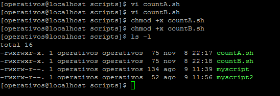
 
 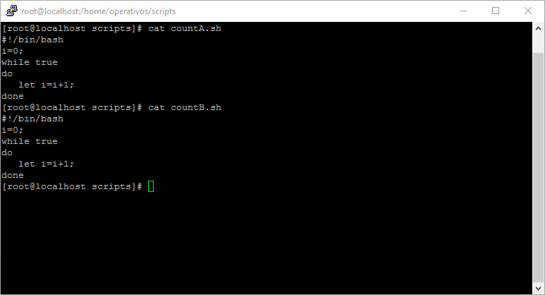

Luego debemos crear estos dos scripts como servicios para que estos puedan ser administrados por systemd, para esto debemos crear en el directorio ```/etc/systemd/system``` los archivos ```countA.service``` y ```countB.service```.

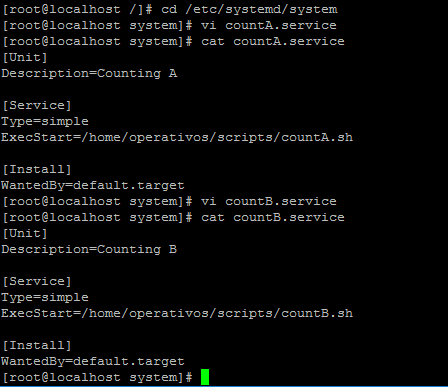

Ejecutamos el comando ```systemctl daemon-reload``` para que el systemd vuelva a cargar todas las configuraciones nuevas que hemos adicionado, es decir para que incluya las configuraciones de los dos nuevos servicios. Después de esto verificamos con el comando ```systemctl status countA.service``` y el comando ```systemctl status countB.service``` si los dos servicios se cargaron exitosamente.

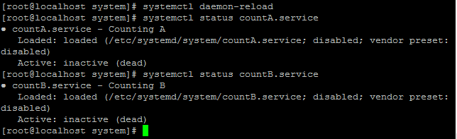

Después de esto, habilitamos los dos servicios con los comandos ```systemctl enable countA.service``` y ```systemctl enable countB.service``` para poder luego modificar sus propiedades con el comando ```systemctl set-property countA.service CPUQuota=50%``` y ```systemctl set-property countB.service CPUQuota=50%``` respectivamente. Con esto estamos poniéndole una restricción con la propiedad del CPUQuota para que ambos servicios solo puedan utilizar como límite máximo el 50% de la capacidad de procesamiento de la CPU.

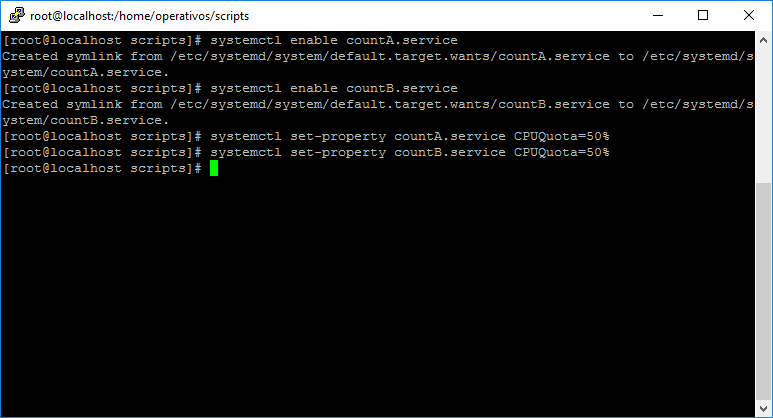

Ahora podemos ejecutar estos dos servicios utilizando los comandos ```systemctl start countA.service``` y ```systemctl start countB.service``` y luego verificamos sus estados con los comandos ```systemctl status countA.service``` y ```systemctl status countA.service```.


Con el comando ```top``` podemos observar en la siguiente imagen como cada uno de los dos procesos countA.sh (PID 3036) y countB.sh (PID 3043) tienen el 50% de la CPU.

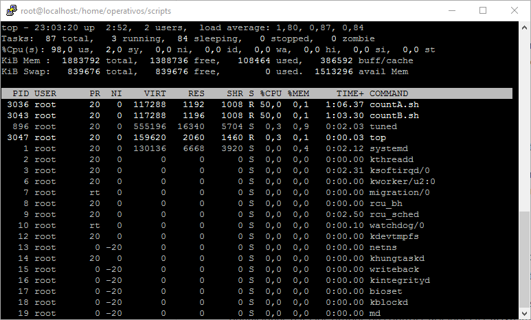

Luego detenemos el proceso countB.sh (PID 3043) con el comando ```systemctl stop countB.service``` y verificamos su estado.

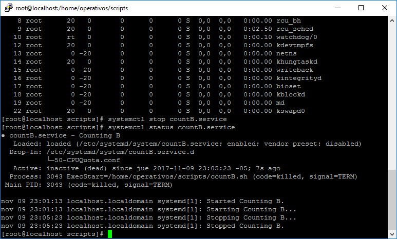

Después de esto podemos observamos cómo el proceso countA.sh (PID 3036) sigue utilizando el 49.8% de la CPU cumpliendo correctamente con la restricción que configuramos a pesar de que hay casi un 50% CPU libre.

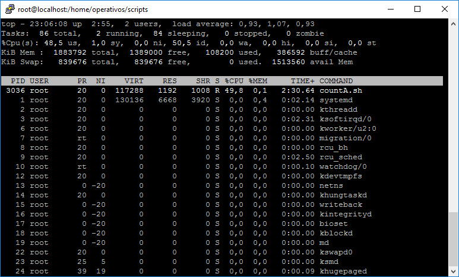

4. Para realizar esta prueba de concepto, utilizamos los mismos dos servicios que creamos en el punto anterior, pero esta vez utilizaremos otro atributo para cambiar la forma en la que se debe restringir el uso de la CPU. En este caso ejecutamos los siguientes comandos ```systemctl set-property countA.service CPUShares=7168``` y ```systemctl set-property countB.service CPUShares=3072``` en donde al servicio countA le asignamos 7168 CPUShares y al servicio countB le asignamos 3072 CPUShares, estos valores significan lo siguiente:

La suma de todos los CPUShares es 10240 = 7168 + 3072 en donde 7168 (Shares del servicio countA) representan el 70% del total y 3072 (Shares del servicio countB) el 30% del total.

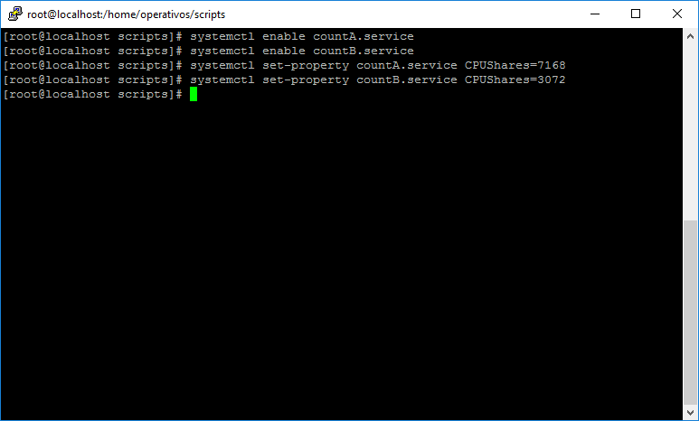

Ejecutamos los dos procesos y verificamos su estado.

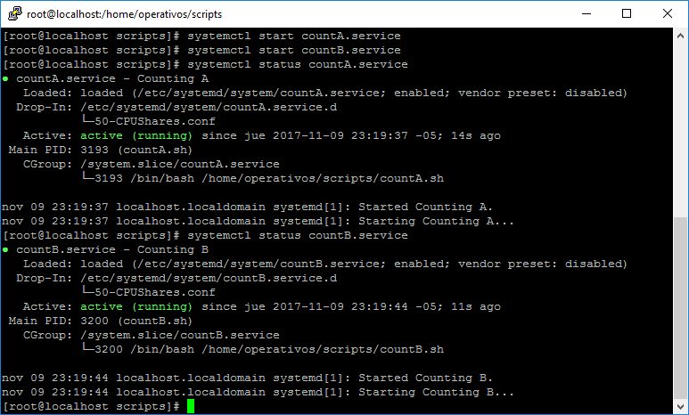

En la siguiente imagen podemos observar efectivamente como el proceso countA.sh (PID 3193) ocupa el 69.8% de la CPU y el proceso countB.sh (PID 3200) ocupa solo el 29.6% de la CPU, ambos respetando las restricciones impuestas.

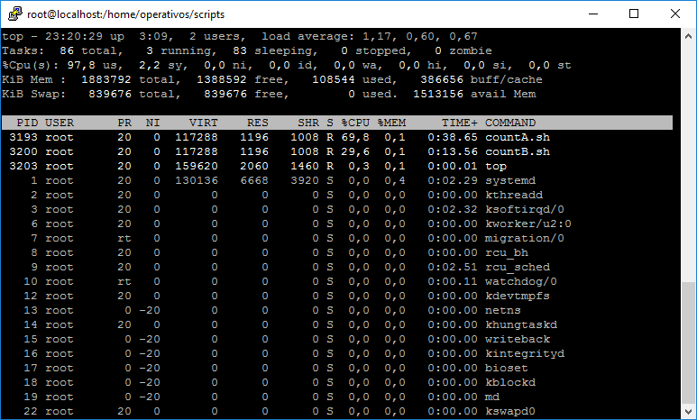

Luego detenemos el servicio countA

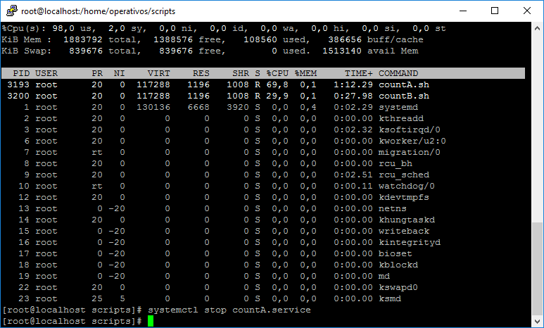

Y por último observamos cómo el proceso que quedo vivo countB.sh (PID 3200) ahora utiliza el 99.9% de la CPU, ocupando el porcentaje de CPU que estaba siendo utilizado por el proceso countA.sh. Por lo que podemos concluir que con el atributo CPUShares la restricción solamente se cumple siempre y cuando los demás servicios que tengan CPUShares se estén ejecutando.

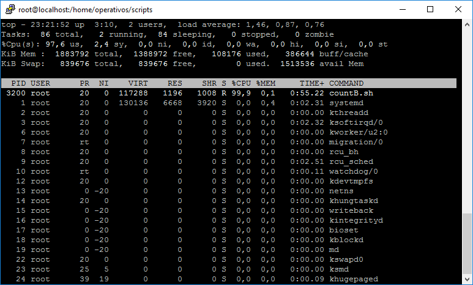
